# Corpus Issue Intake & UXR Curation Plan

**Status:** Draft — designed 2026-07-30 (Bryan Kemp + Claude session). Nothing in this plan is built yet. Open decisions are listed at the bottom and must be resolved before the phases that depend on them.

**What this enables:** anyone in the org (eventually gated by MCP SSO) can contribute assets to the knowledge corpus by filing a GitHub issue — no git, no terminal, no YAML. The issue carries the asset and its initial tagging; Claude processes it into corpus markdown through the existing PR gate; a senior UXR curator can then browse, review, and retag the material without ever touching a repo clone.

**The core bet** (same as [tek-system-core](./tek-system-core.md)): codified, versioned, queryable systems compound. This plan adds a *contribution* front door and a *curation* layer to a corpus pipeline that already works.

---

## 1. The workflow at a glance

```mermaid
flowchart LR
    A[Contributor files\nissue form] -->|dropdowns auto-apply\nnamespaced labels| B[Issue in backlog\nwith attachments]
    B -->|"human review, then:\n'Claude, commit this'"| C[Claude fetches attachments\nto corpus/_inbox/]
    C -->|existing corpus-intake\nrouting + document-* skills| D[PR with corpus markdown\n+ seeded frontmatter]
    D -->|review = curation gate| E[Squash-merge to main]
    E -->|ingest.yml re-ingests\nautomatically| F[Live in MCP corpus search]
    F -->|curator browses via MCP\nor Bench UXR browser| G[Retag request]
    G -->|frontmatter-only PR| D
```



Two properties make this cheap to build:

1. **Every stage after the issue already exists.** `corpus-intake` routing, the `document-*` skills, the PR gate, and `ingest.yml` re-ingestion on push to `main` are all shipped and proven. The new surface area is the issue form, an attachment-fetch step, and the curation conventions.
2. **Retagging is nearly free.** Because the MCP corpus re-ingests from the repo on every push to `main`, a retag is just a frontmatter edit merged through a PR. There is no separate index to maintain and no retagging system to build.

## 2. Design decisions already made

These were agreed in the 2026-07-30 design session and are not open questions:

| Decision | Rationale |
|---|---|
| **Issue forms, not blank issues.** Intake goes through YAML issue forms (`.github/ISSUE_TEMPLATE/`) with dropdowns for subject and asset class. | Dropdowns *are* the controlled vocabulary. Free-form labeling by submitters is how taxonomies rot; dropdowns can't rot. |
| **Labels seed frontmatter one-way.** Dropdown choices auto-apply namespaced labels (`subject:2450-ec`, `class:transcript`); Claude reads them once at processing time. After that, **frontmatter is the source of truth** and the issue is an audit trail only. | Keeping labels and frontmatter in sync forever is a losing battle. One-way seeding is simple and sufficient. |
| **Two-layer frontmatter.** A machine-written intake layer (existing keys: `provenance`, `class`, `product`, `recorded_date`, `transcript_source`, `related_*`, …) plus a separate human-owned `uxr:` curation block. | Separate blocks mean a re-run of any `document-*` skill can never clobber human curation, and anyone reading a file can tell what a machine asserted vs. what a person curated. |
| **The PR is the preview.** Curation review happens on the PR diff before merge — same gate as all other repo work. | Reuses the proven review muscle instead of inventing a parallel approval system. |
| **The corpus/UXR boundary holds.** Raw *observed* material (transcripts, recordings, screenshots) routes to `corpus/sources/<subject>/`; *authored analysis* (syntheses, findings readouts) lives in `uxr/<project-id>/`. This is the precedent already set by `tek-express-ae-interviews` (raw transcripts in `corpus/sources/tek-express/`, synthesis in `uxr/`), and [uxr/README.md](../uxr/README.md) explicitly keeps UXR conventions unlocked pending team input. | This plan formalizes the intake path for the *corpus* side. It proposes — but does not lock — UXR-side conventions; see Open decision 4. |

## 3. Frontmatter spec

### 3.1 Intake layer (machine-written — exists today)

The `document-*` skills already write this. Unchanged, except intake-sourced files gain one new key, `source_issue`:

```yaml
---
provenance: observed
class: walkthrough
product: tek-express
flow_id: ae-nadir-kahn-pain-points-and-automation
recorded_by: "Nadir Kahn (AE); Bryan Kemp (facilitator)"
recorded_date: 2026-07-14
transcript_source: "uploads/transcripts/NadirKahn.docx"
source_issue: 342            # NEW — the intake issue number, for the audit trail
related_screens: [running-test, status-test-status]
# … existing keys unchanged
---
```

Nobody hand-edits this layer. If an intake value is wrong, the fix is re-running the skill or a reviewed PR — same as today.

### 3.2 Curation layer (human-owned — new)

A single optional top-level `uxr:` map, added and edited only by humans (directly or by directing Claude), never written by intake skills:

```yaml
uxr:
  method: contextual-interview        # from the taxonomy's method list
  personas: [application-engineer]    # from the taxonomy's persona list
  themes: [progress-visibility, automation-hooks, report-size]
  curated_by: bkemp
  curated_date: 2026-08-02
```

Rules:

- **Values come only from the taxonomy** (§4). The CI schema check (§6, P0) fails any PR introducing a value not in the taxonomy — typo-proofing for humans and drift-proofing for Claude alike.
- **Skills must round-trip it untouched.** Any `document-*` skill re-run on a file with a `uxr:` block preserves it byte-for-byte. This is the enforcement mechanism for "two layers, two owners."
- Absence is meaningful: no `uxr:` block = not yet curated. The Bench browser (P1) uses this to show an "uncurated" queue.

### 3.3 Starter taxonomy (strawman — Open decision 1)

Derived from material already in `uxr/` and `corpus/sources/tek-express/walkthroughs/`. **This is a conversation starter for the taxonomy decision, not a locked vocabulary:**

| Field | Starter values | Source |
|---|---|---|
| `method` | `contextual-interview`, `usability-session`, `voc-briefing`, `survey`, `field-observation` | AE interview round; VOC library briefing |
| `personas` | `application-engineer`, `bench-engineer`, `compliance-test-engineer`, `internal-stakeholder` | Roles present in the July 2026 AE interviews and VOC material |
| `themes` | Seeded from the phased-findings structure (`immediate-prototype`, `global-ui`, `panel-ui`) plus recurring pain points (`progress-visibility`, `automation-hooks`, `reporting`, `first-use`) | [uxr/tek-express-ae-interviews/phased-findings.md](../uxr/tek-express-ae-interviews/phased-findings.md) |

The taxonomy lives as a single versioned file (proposed: `uxr/taxonomy.yml`) that is simultaneously: the source for the issue-form dropdowns, the schema the CI check validates against, and the reference doc for curators. One file, three consumers, zero drift.

## 4. Label scheme

Namespaced, mirroring frontmatter keys so the mapping is mechanical:

| Label | Maps to | Applied by |
|---|---|---|
| `subject:<product>` (e.g. `subject:2450-ec`) | `product:` frontmatter | Issue-form dropdown |
| `class:<asset-class>` (e.g. `class:transcript`) | `class:` frontmatter + `_inbox` routing | Issue-form dropdown |
| `intake:corpus` | Marks the issue as a corpus-intake request | Issue form (automatic) |
| `intake:retag` | Marks the issue as a retag request | Retag form (automatic) |
| `intake:processed` | Processing PR opened; issue closes when it merges | Claude, at processing time |

Existing repo labels (theme/priority from the backlog system) are untouched — the `intake:*` namespace keeps the two systems from colliding.

## 5. Phased delivery

### P0 — the working pipeline (buildable now, ~1 PR each)

Blocked only by Open decision 1 (taxonomy) for items 2–4; item 1 can start immediately.

| # | Deliverable | Detail |
|---|---|---|
| 1 | `uxr/taxonomy.yml` + taxonomy decision | Turn §3.3's strawman into a reviewed, locked v1 with Bryan + team. Everything else consumes this file. |
| 2 | `.github/ISSUE_TEMPLATE/corpus-intake.yml` | Dropdowns for subject (from `corpus/sources/` folder list) and asset class (from the `document-*` skill classes); attachment guidance (~25 MB/file cap; larger recordings via link); auto-applies `subject:`/`class:`/`intake:corpus` labels. Plus `config.yml` for the chooser page. |
| 3 | `.github/ISSUE_TEMPLATE/retag-request.yml` | Dropdowns for subject + new tag values (from taxonomy); free-text "which chunks" field. Auto-applies `intake:retag`. |
| 4 | CI frontmatter schema check | Workflow validating every `uxr:` block in a PR against `uxr/taxonomy.yml`; fails on unknown values. Same philosophy as the MCP eval gate. |
| 5 | `corpus-intake` skill extension | New entry path: given an intake issue number, fetch attachments into `corpus/_inbox/`, then run existing routing. Write `source_issue:` into frontmatter. Label the issue `intake:processed`; the processing PR's `Closes #N` closes it on merge. |
| 6 | `uxr:` round-trip rule in `document-*` skills | One-line addition to each SKILL.md: preserve any existing `uxr:` block byte-for-byte on re-runs. |

**P0 exit state:** a contributor with a GitHub account can file a structured intake issue; on Bryan's go, Claude lands it in the corpus through a reviewed PR; a curator can request retags via form or `@claude` comment; CI blocks taxonomy drift. The senior-UXR read path is the MCP endpoint they already have.

### P1 — the curation experience

| # | Deliverable | Detail |
|---|---|---|
| 1 | Bench UXR browser (read-only) | Token-driven Bench tool walking `uxr:` frontmatter across the corpus: chunks grouped by persona/theme/method, an "uncurated" queue (files with no `uxr:` block), each card linking to the file on GitHub. Registered in `apps/bench/tools.js` per the Bench contract. |
| 2 | Per-PR preview ingest | Already an open item in [apps/mcp/README.md](../apps/mcp/README.md#eval-harness). This workflow is its forcing function: a curator retagging chunks should be able to query the *proposed* corpus state before merge, not after. |
| 3 | SSO gating alignment | When MCP org SSO (#231) ships, decide whether the intake form stays public or is documented as org-members-only (Open decision 3). |

### P2 — only if volume demands it

| # | Deliverable | Detail |
|---|---|---|
| 1 | Bench edit-in-place curation | "Propose retag" buttons in the Bench browser opening frontmatter PRs via the GitHub API. Needs auth plumbing (GitHub App/OAuth). **Explicitly deferred:** build only if the P0 retag path (form + `@claude`) proves too slow for real curation volume. |

## 6. Guardrails

- **No confidence without proof:** the intake pipeline is only "working" when a real asset has gone issue → PR → merge → retrievable via MCP query. That end-to-end run is the P0 acceptance test.
- **Taxonomy changes are PRs to `uxr/taxonomy.yml`** — reviewed like everything else, and the CI check + issue forms pick them up mechanically.
- **The issue is never the record.** If issue text and merged frontmatter disagree, frontmatter wins; the issue is provenance only.
- **Binary hygiene:** corpus `uploads/` conventions apply to fetched attachments exactly as they do to `_inbox` drops today. UXR-side binaries stay gitignored per [uxr/README.md](../uxr/README.md).

## 7. Dependencies on existing open items

| This plan needs | Status |
|---|---|
| UXR + analytics taxonomy ([tek-system-core](./tek-system-core.md) Part 5) | Planned, unstarted — P0 item 1 *is* the first concrete slice of it |
| MCP org SSO (#231) | Open, org-gated — P1; P0 works without it |
| Per-PR preview ingest ([apps/mcp/README.md](../apps/mcp/README.md#eval-harness)) | Open — P1 item 2 |

## 8. Open decisions

Unresolved — flagged for Bryan / team. Nothing below is decided by this document.

1. **Taxonomy v1 vocabulary.** §3.3 is a strawman from existing material. Which methods, personas, and themes make the locked v1? Gates P0 items 2–4.
2. **Curation timing.** Curate at intake-PR review (one gate, but taxonomy debate can block assets landing) or as a separate later pass (intake merges fast with intake-frontmatter only; `uxr:` blocks arrive in follow-up PRs)? Claude leans separate-pass; Bryan to rule.
3. **Intake gating.** The repo is public, so anyone with a GitHub account can file the form today. Accept that openness, or document/enforce org-members-only once SSO (#231) ships?
4. **Where curated UXR analysis lives.** This plan keeps the observed-material-in-corpus / authored-analysis-in-`uxr/` split. But should the `uxr:` curation block also apply to files under `uxr/` itself (making them queryable by the same taxonomy), and does UXR eventually get its own ingest into the MCP endpoint? [uxr/README.md](../uxr/README.md) explicitly defers this to team input — this plan does not resolve it.
5. **Who besides Bryan can say "commit this."** Today the processing trigger is Bryan reviewing the backlog. Does the senior UXR curator get the same trigger authority for `intake:retag` issues?
